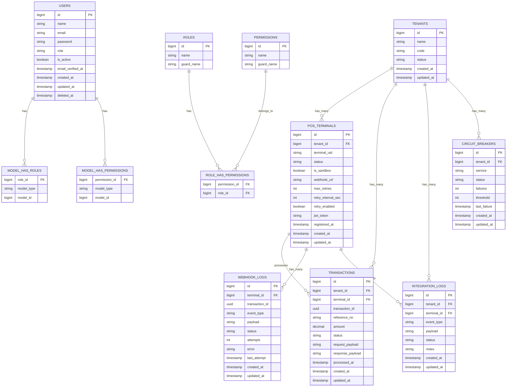

# TSMS Database Structure Reference

## Entity Relationship Diagram

## Table Descriptions

### Core Tables
- **TENANTS**: Main table for multi-tenant architecture
- **POS_TERMINALS**: Point of Sale terminals configuration and management
- **TRANSACTIONS**: Transaction records and processing data

### Logging Tables
- **INTEGRATION_LOGS**: System integration event logging
- **WEBHOOK_LOGS**: Webhook delivery attempts and status tracking

### Authentication & Authorization
- **USERS**: User management and authentication
- **ROLES**: Role definitions for RBAC
- **PERMISSIONS**: Permission definitions
- **MODEL_HAS_ROLES**: Polymorphic role assignments
- **MODEL_HAS_PERMISSIONS**: Direct permission assignments
- **ROLE_HAS_PERMISSIONS**: Role-permission mappings

### System Tables
- **CIRCUIT_BREAKERS**: Service health monitoring and circuit breaker pattern implementation