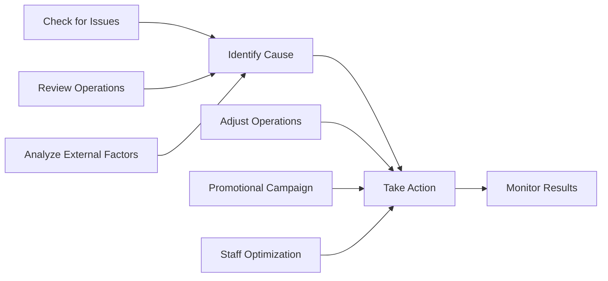

# PITX Dashboard Improvement Analysis

Based on the data presented in the Paranaque Integrated Terminal Exchange (PITX) dashboard image, here are comprehensive recommendations for improvement.

To keep scope clear for the current brownfield dashboard work, each section is tagged with a phase:

- **Phase 1 (Current Sprint)** – small, high‑impact fixes that align with existing endpoints and UI.
- **Phase 2 (Near Term)** – requires some additional queries/endpoints or layout changes, but no new analytics engine.
- **Future / Advanced** – predictive/BI‑style features that need separate product and architecture work.

## 1. Critical Data Accuracy Issues _(Phase 1 – In Scope)_

### Inconsistent Currency Symbols
**Issue:** The dashboard uses conflicting currency symbols:
- **TOTAL REVENUE KPI:** Shows `$0.00` (USD)
- **Transaction Analytics:** Shows values in `₱` (Philippine Peso)
- **Recent Activity:** Shows values with `P` (alternative PHP notation)

**Recommendation:**
- Standardize all currency displays to **₱ (PHP)** as PITX operates in the Philippines
- Investigate and fix the `$0.00` TOTAL REVENUE value - this appears to be a data mapping error
- Apply consistent formatting: `₱1,600,000.00` across all monetary displays

## 2. Information Hierarchy & Context _(Phase 1–2 – Partly In Scope)_

### Missing Time Filters
**Issue:** Key metrics lack temporal context:
- TOTAL TRANSACTIONS: 648 (but for what period?)
- ACTIVE TERMINALS: 87/87 (real-time or daily average?)

**Recommendation:**

### Add Global Date Filter at Dashboard Top _(Phase 2)_:
- [Last 24 Hours] [Today] [This Week] [This Month] [Custom Range]
- Selected: March 1-7, 2026

### Voided Transactions Enhancement _(Phase 1)_
**Current:** `VOIDED TRANSACTIONS: 0`

**Improved Display:**
VOIDED TRANSACTIONS VOID RATE
0 0.0%
[No change from yesterday]

## 3. Data Visualization Improvements _(Phase 1–2)_

### Sales Performance Visualization _(Phase 1)_
**Current:** Text-based table showing March 1-7 data
| Mar 01 | Mar 02 | Mar 03 | Mar 04 | Mar 05 | Mar 06 | Mar 07 |
|₱1,600,000 | ₱1,400,000 | ₱1,200,000 | ₱800,000 | ₱600,000 | ₱400,000 | ₱200,000 |

**Recommended: Interactive Line/Bar Chart**

### Data Table _(Phase 2 – Optional)_

| Date | Day | Sales (₱) | Change vs Previous Day | Trend Indicator |
|------|-----|-----------|------------------------|-----------------|
| Mar 01 | Sunday | 1,600,000 | - | Baseline |
| Mar 02 | Monday | 1,400,000 | ↓ 200,000 (-12.5%) | 📉 |
| Mar 03 | Tuesday | 1,200,000 | ↓ 200,000 (-14.3%) | 📉 |
| Mar 04 | Wednesday | 800,000 | ↓ 400,000 (-33.3%) | 📉🔴 |
| Mar 05 | Thursday | 600,000 | ↓ 200,000 (-25.0%) | 📉 |
| Mar 06 | Friday | 400,000 | ↓ 200,000 (-33.3%) | 📉🔴 |
| Mar 07 | Saturday | 200,000 | ↓ 200,000 (-50.0%) | 📉🔴 |

### Key Insights

#### Performance Metrics
| Metric | Value |
|--------|-------|
| **Total Weekly Revenue** | ₱6,200,000 |
| **Average Daily Revenue** | ₱885,714 |
| **Peak Day** | March 1 (₱1,600,000) |
| **Lowest Day** | March 7 (₱200,000) |
| **Weekly Trend** | 📉 Consistent Decline (-87.5% from peak) |

#### Observations
1. **Declining Pattern**: Sales decreased every single day throughout the week
2. **Sharpest Drop**: March 6-7 saw the steepest decline (-50%)
3. **Mid-week Stability**: March 3-4 showed relatively moderate decline
4. **Weekend Performance**: Saturday (Mar 7) recorded lowest sales

### Recommendations Based on Trend

### System Health Visualization _(Phase 1)_
**Current:** Text-only indicators
- CPU UTILIZATION
- MEMORY USAGE
- NETWORK: Stable

**Recommended: Progress Indicators**

SYSTEM HEALTH METRICS
┌─────────────────────────────────┐
│ CPU UTILIZATION [████▒▒▒▒▒▒] 34% │
├─────────────────────────────────┤
│ MEMORY USAGE [██████▒▒▒▒] 62% │
├─────────────────────────────────┤
│ NETWORK STATUS ● Stable │
│ LATENCY 24ms │
│ PACKET LOSS 0.0% │
└─────────────────────────────────┘

## 4. Enhanced Key Performance Indicators _(Phase 1–2)_

### Current KPI Row
| TOTAL REVENUE | TOTAL TRANSACTIONS | VOIDED TRANSACTIONS | ACTIVE TERMINALS |
| $0.00 | 648 | 0 | 87/87 |

### Recommended KPI Dashboard _(Phase 2 – Layout Refinement)_

╔════════════════════════════════════════════════════════════════════════╗
║ KEY METRICS ║
╠═══════════════════════════╦════════════════════════╦══════════════════╣
║ TOTAL REVENUE ║ AVG TICKET SIZE ║ TOTAL TRANSACTIONS ║
║ ₱6,200,000 ║ ₱9,568 ║ 648 ║
║ ↓ 12% from prev period ║ ↑ 3% from prev ║ ↓ 8% from prev ║
╠═══════════════════════════╬════════════════════════╬══════════════════╣
║ VOIDED TRANSACTIONS ║ VOID RATE ║ ACTIVE TERMINALS║
║ 0 ║ 0.0% ║ 87 / 87 ║
║ No change from prev ║ Target: <0.5% ║ 100% Uptime ║
╚═══════════════════════════╩════════════════════════╩══════════════════╝

## 5. Recent Activity Logs Enhancement _(Phase 2 – Layout & New Queries)_

### Current Table Issues
- All 8 entries show identical terminal names and amounts
- No differentiation between transactions
- Limited actionable information

### Recommended Multi-Tab Approach

**Tab 1: Recent Transactions**
| ID | Transaction ID | Terminal | Route/Destination | Net Sales | Status | Timestamp | Actions |
|----|---------------|----------|-------------------|-----------|--------|-----------|---------|
| #158288 | eca3d66... | Gate A - Terminal 1 | Manila to Cavite | ₱574.23 | ✓ Completed | 2026-02-28 20:25 | [View] |
| #158287 | beed83b... | Gate B - Terminal 3 | Manila to Laguna | ₱1,250.00 | ✓ Completed | 2026-02-28 20:24 | [View] |

**Tab 2: Top Performing Terminals (Today)**
| Rank | Terminal ID | Location | Transactions | Revenue | Utilization |
|------|-------------|----------|--------------|---------|-------------|
| 1 | Gate A-01 | North Wing | 156 | ₱89,450 | 98% |
| 2 | Gate C-12 | South Wing | 142 | ₱82,300 | 95% |

**Tab 3: System Events**
| Time | Event Type | Terminal | Description | Status |
|------|-----------|----------|-------------|--------|
| 20:25 | Transaction | T1 | Batch processed | Success |
| 20:20 | Sync | All | Database sync | Completed |

## 6. Additional Advanced Features _(Future / Advanced)_

### Predictive Analytics Widget
📊 FORECAST (Next 7 Days)
Expected Revenue: ₱4.2M (±5%)
Peak Hours: 6:00-9:00 AM, 4:00-7:00 PM
Recommended Staffing: 85% capacity

---

## Phase 1 Implementation Checklist (Dashboard Command Center)

This section extracts only the **Phase 1 (current sprint)** items into an actionable checklist.

### A. Data Accuracy & Currency
- [ ] Standardize all dashboard currency rendering to `₱` (PHP).
- [ ] Wire **Total Revenue** card to `total_sales.current` from `DashboardService::getAdvancedMetrics`.
- [ ] Ensure consistent money formatting (e.g., `₱1,234.56`) in:
    - [ ] KPI row
    - [ ] Transaction Analytics charts
    - [ ] Recent Activity table

### B. Time Context for KPIs
- [ ] Align KPI period with the dashboard’s current time basis (today vs selected range).
- [ ] Add helper text or subtitle for metrics, e.g. "Today" / "Last 24 Hours".
- [ ] Confirm Active Terminals reflects real‑time active count vs total.

### C. Voided Transactions
- [ ] Compute void count for today (or selected period).
- [ ] Derive **Void Rate** = voids / total_transactions.
- [ ] Display both `VOIDED TRANSACTIONS` and `VOID RATE` in the KPI area.

### D. Sales Performance Visualization
- [ ] Use existing `TransactionChart` for daily sales and volume.
- [ ] Ensure chart labels and tooltips show `₱` and clear dates.
- [ ] Optionally surface small summary bullets under the chart:
    - [ ] Total revenue for the plotted period
    - [ ] Peak revenue day
    - [ ] Lowest revenue day

### E. System Health Visualization
- [ ] Render CPU and Memory as progress bars / gauges instead of plain text.
- [ ] Keep Network status with a simple indicator (● Stable / Warning / Critical).
- [ ] Show queue backlog count (jobs table) in the health widget.

### F. Validation & Documentation
- [ ] Verify dashboard metrics against reference SQL queries on `transactions`.
- [ ] Capture screenshots before/after to document changes.
- [ ] Link this checklist to the relevant brownfield PRD / story in the BMad bundle.

