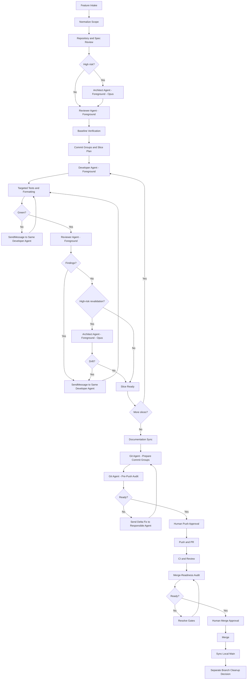

# Brownfield Feature Orchestration Workflow

The diagram below is the full, high-risk path. Most changes should not run every gate in it — see "Risk-Based Gate Selection" below before starting. Selecting the wrong tier upward wastes tokens; selecting it downward risks missed regressions. When unsure, default to medium, and escalate to high only against the explicit High-Risk Gates list.

For feature-sized work, Feature Intake (`prompt-library.md` item 1) routes through this repository's installed Spec Kit workflow (specify → clarify → plan → tasks → analyze) before risk classification runs. Trivial, localized changes skip Spec Kit entirely.



## Risk-Based Gate Selection

Not every change needs every gate. Classify risk at intake and skip the gates the tier doesn't require — this is the primary lever for keeping orchestration token-light, not shorter prompts.

### Low risk

Isolated change, no shared-infrastructure effect, easily reversible (single-file fix, copy/formatting change, new isolated endpoint with no shared dependents).

```text
Intake → Developer Agent (foreground) → Targeted Tests → Reviewer Agent (foreground) → Commit → CI → Human Approval
```

Skip: Architecture Review, Baseline Verification, Documentation Sync, standalone Pre-Push Audit, standalone Merge-Readiness Audit. CI plus human approval at push/merge substitute for the last two — do not spawn a dedicated audit agent for a change this small.

### Medium risk

Touches shared services, controllers, routes, or common tests, but is not on the High-Risk Gates list.

```text
Intake → Regression-Impact Review (Reviewer Agent, foreground) → Baseline → Slice Loop → Documentation Sync → Commit-Group Prep → Commit → CI → Human Approval
```

Skip: Architecture Review. Fold pre-push verification into the commit-group prep step rather than running it as a separate audit call, unless the diff has grown large enough to warrant one.

### High risk

Redis/Lua, queue topology, auth, tenancy, migrations, state machines, financial/reporting correctness, or deployment-sensitive config — see High-Risk Gates below. Run the full diagram above; every gate is mandatory.

## Slice Loop Contract

Each slice must use:

1. foreground developer agent;
2. exact acceptance checks;
3. foreground reviewer;
4. SendMessage back to the original developer agent for corrections;
5. new agent only when responsibility changes or continuity is impossible.

## High-Risk Gates

Use Opus or the strongest available reviewer model for:

- Redis Lua;
- queue topology;
- authorization;
- tenancy and data isolation;
- migrations affecting production data;
- financial/reporting correctness;
- state machines;
- final pre-push audit for high-risk features.
